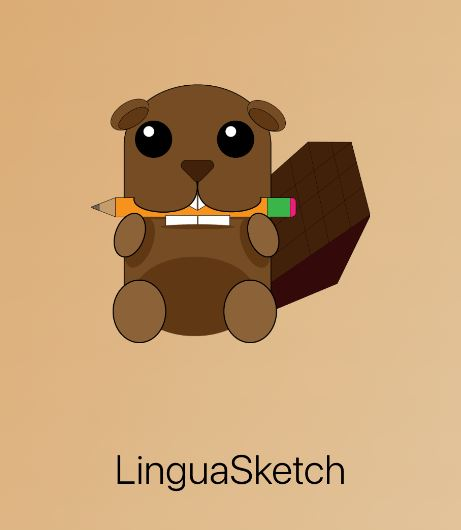

<h1>LinguaSketch - Fall 2023 Hackathon Project</h1>

LinguaSketch is a flashcard learning mobile app that allows users to draw images on flashcards to assist with language learning. We support Spanish, Korean, Chinese, German, and French learning.

<a href="https://www.youtube.com/watch?v=NfNz3eVMTSE">Link to YouTube hackathon submission video</a>
 

<h2>Built With</h2>

React Native, Expo

<h4>To run the app:</h4>
<ol>
    <li>Run <code>npm install</code></li>
    <li>Run <code>npx expo</code></li>
</ol>

<h4>To view the running application, you can:</h4>
<ol>
    <li>Install an Xcode iPhone Simulator or Android Studio and press the corresponding key on the terminal</li>
    <li>Install Expo Go on iPhone or Android and scan the QR code with your camera app</li>
</ol>

